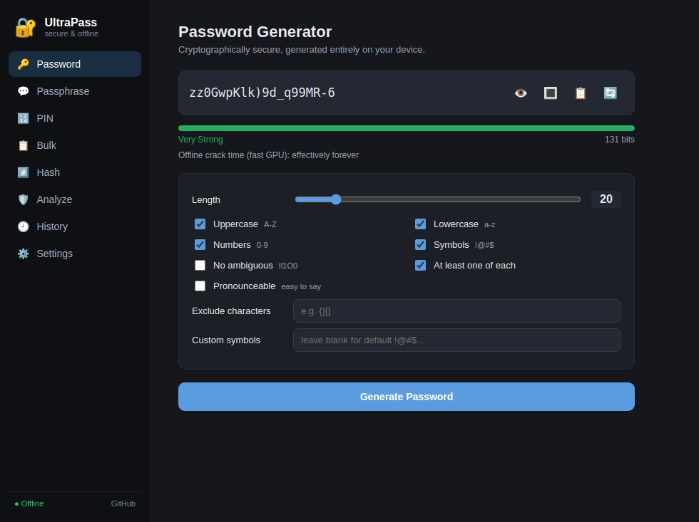
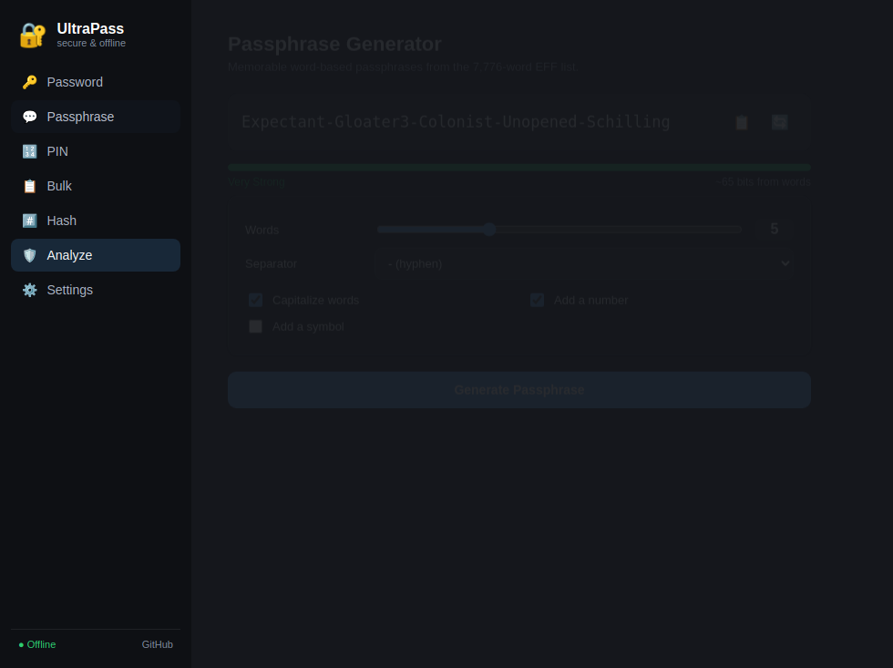

<div align="center">

# 🔐 UltraPass

### A fast, private, cross-platform password toolkit — generate, analyze & hash, 100% offline.

[](https://github.com/ian-louw/password-generator/actions/workflows/build.yml)
[](LICENSE)




</div>

---

UltraPass started life as a small Streamlit web app and is now a polished
**Electron desktop application**. Everything runs on your machine — there are no
network calls, no telemetry, and no accounts. Your secrets never leave your
device.

## ✨ Features

- **🔑 Password generator** — length 4–128, toggle character classes, exclude
  ambiguous characters (`Il1O0`), exclude any custom characters, supply your own
  **custom symbol set**, an optional **pronounceable** mode, and a guarantee of
  at least one of each selected type.
- **💬 Passphrase generator** — memorable phrases from the full **7,776-word EFF
  Diceware list** (~12.9 bits/word), with separators, capitalization, and
  optional number/symbol.
- **🔢 PIN generator** — quick numeric PINs (3–16 digits).
- **📋 Bulk mode** — generate up to 10,000 passwords at once and export to
  `.txt`/`.csv`.
- **🛡️ Strength analyzer** — real entropy in bits, **crack-time estimates** for
  four attacker scenarios, plus detection of dictionary words, sequences,
  keyboard runs, repeats, and dates — with actionable suggestions.
- **#️⃣ Hashing & verification** — **bcrypt** (configurable cost 4–15),
  **scrypt**, **PBKDF2-SHA256**, SHA-256, SHA-512, and a tool to verify a
  password against an existing bcrypt hash.
- **🔳 QR codes** — show any password/passphrase as a QR code to scan onto your
  phone — generated locally, never uploaded.
- **🕘 Session history** — review recently generated secrets (kept in memory
  only, masked by default, wiped on quit).
- **👁️ Reveal / hide & shortcuts** — mask outputs, hide-on-blur, `Ctrl/Cmd+G`
  to regenerate, `Esc` to hide.
- **🔒 Privacy by design** — fully offline, OS CSPRNG, auto-clearing clipboard
  (and clipboard wipe on quit), hardened renderer (sandbox + context isolation
  + strict CSP + deny-all permissions).
- **🎨 Light / dark / system themes** with persisted preferences.

<div align="center">

</div>

## 📥 Download

Pre-built installers for **Windows, macOS, and Linux** are published on the
[Releases page](https://github.com/ian-louw/password-generator/releases). Every
tagged release builds:

| Platform | Format |
|----------|--------|
| Windows  | `.exe` installer (NSIS) + portable `.exe` |
| macOS    | `.dmg` + `.zip` |
| Linux    | `.AppImage` + `.deb` |

> Builds are not code-signed, so your OS may show an "unidentified developer"
> prompt on first launch. Everything is open source — feel free to build it
> yourself (below).

## 🛠️ Build from source

Requires [Node.js](https://nodejs.org) 18+.

```bash
git clone https://github.com/ian-louw/password-generator.git
cd password-generator/desktop
npm install

npm start          # run the app
npm test           # run the unit tests
npm run dist       # build an installer for your OS
```

## 🔒 Security

- All randomness comes from the OS CSPRNG (`crypto.randomInt` /
  `crypto.randomBytes`) — never `Math.random()`.
- Unbiased selection via rejection sampling and a cryptographic Fisher–Yates
  shuffle.
- Renderer runs with `contextIsolation`, `sandbox`, no `nodeIntegration`, and a
  strict Content-Security-Policy.
- No password is ever written to disk; the clipboard can auto-clear.

See [SECURITY.md](SECURITY.md) for the full policy and how to report issues.

## 🌐 Web version

The original browser version (Python + Streamlit) still lives at the repo root:

```bash
pip install -r requirements.txt
streamlit run app.py
```

**Live app:** [free-password-generator.streamlit.app](https://free-password-generator.streamlit.app)

## 🤝 Contributing

Contributions are welcome — see [CONTRIBUTING.md](CONTRIBUTING.md).

## 📄 License

[MIT](LICENSE) © 2026 Ian Louw. Bundles the EFF Large Diceware Wordlist
([CC BY 3.0 US](https://www.eff.org/dice)).
